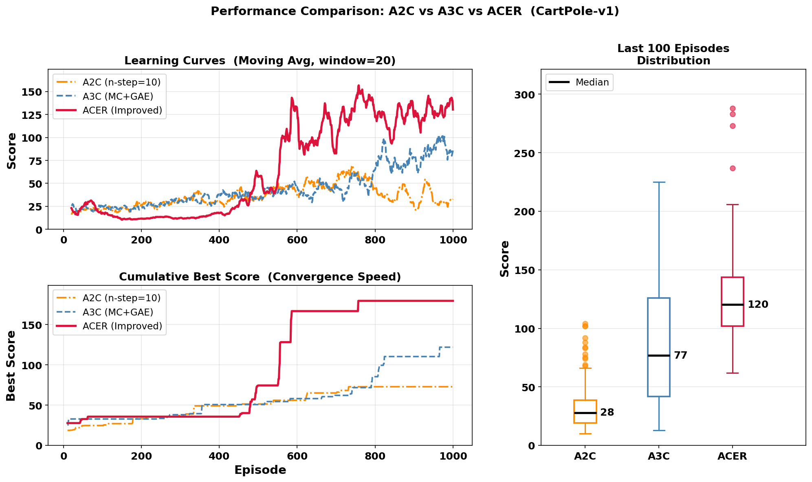

# A2C / A3C / ACER 강화학습 알고리즘 비교 테스트

CartPole-v1 환경에서 세 가지 Actor-Critic 계열 강화학습 알고리즘을 구현하고 성능을 비교 분석한다.

---

## 개요

본 테스트는 A2C(Advantage Actor-Critic), A3C(Asynchronous Advantage Actor-Critic), ACER(Actor-Critic with Experience Replay)를 동일한 환경과 조건에서 구현하여 학습 효율, 수렴 속도, 성능 안정성을 실험적으로 검증한다.

각 알고리즘의 설계 원리와 하이퍼파라미터 조정이 학습 성능에 미치는 영향을 분석하는 것을 목표로 한다.

---

## 알고리즘 비교

| 항목              | A2C                                          | A3C                                                    | ACER                                                          |
| :---------------- | :------------------------------------------- | :----------------------------------------------------- | :----------------------------------------------------------- |
| **구조**          | ACNet (공유 백본, π·V 헤드)                   | ACNet (공유 백본, π·V 헤드)                              | ACERNet (공유 백본, π·Q 헤드) + 리플레이 버퍼 + 타겟 네트워크 |
| **학습 방식**     | On-policy, n-step TD                         | On-policy, MC + GAE                                      | Off-policy, Importance Sampling                            |
| **업데이트 단위** | n-step 청크 (n=10)                            | 에피소드 전체 궤적                                         | 리플레이 버퍼 미니배치 (16)                                 |
| **리턴 추정**     | n-step 누적 보상                               | GAE (λ=0.96)                                            | TD 타겟 (타겟 네트워크)                                       |
| **LR 스케줄**     | CosineAnnealingWarmRestarts                  | 고정                                                      | 고정 + Entropy Annealing                                   |
| **장점**          | 구현 단순, 잦은 업데이트, MC보다 낮은 분산       | 편향 낮음(MC), GAE로 분산-편향 균형 조절                   | 샘플 재사용으로 높은 효율, 안정적 Q 추정                      |
| **단점**          | 단일 스레드 특성상 샘플 상관성 높음, 후반 불안정 | 에피소드 단위 업데이트로 수렴 느림, 긴 에피소드에서 분산 증가 | 구현 복잡, 하이퍼파라미터 민감성 높음                         |

---

## 환경 및 설정

- **환경**: CartPole-v1 (최대 점수 500, 총 1,000 에피소드)
- **할인율 (γ)**: 0.99
- **공통 학습률**: 0.0003 (Adam optimizer)
- **장치**: CUDA (GPU 가용 시) / CPU 자동 전환

---

## 알고리즘 설계

### A2C — n-step TD Return

- n-step(n=10) 청크 단위로 업데이트하여 MC 대비 낮은 분산과 더 잦은 업데이트를 실현한다.
- CosineAnnealingWarmRestarts(T₀=200, T_mult=2) 스케줄러를 적용하여 에피소드 200·400·800에서 학습률을 재가열, 후반 학습 붕괴를 방지한다.
- 엔트로피 계수는 0.10으로 상향 조정하여 후반 정책 다양성을 유지한다.

### A3C — Monte Carlo Return + GAE

- 전체 에피소드 궤적을 수집한 후 GAE(Generalized Advantage Estimation, λ=0.96)로 어드밴티지를 추정하고 한 번에 업데이트한다.
- MC 기반 리턴으로 편향이 낮으나 에피소드 단위 업데이트로 학습이 느리다. GAE λ를 0.98에서 0.96으로 낮춰 분산 과대를 억제하였다.

### ACER — Off-policy + Importance Sampling

- Experience Replay 버퍼(최대 50,000)에서 미니배치를 샘플링하여 off-policy 학습을 수행한다.
- Importance ratio ρ = π_now / π_old 를 계산하고 C-bar 클리핑(C=2.0)으로 분산을 제어하며, 클리핑으로 누락된 부분은 바이어스 보정 항으로 복원한다.
- 타겟 네트워크(τ=0.01 소프트 업데이트)로 Q값 추정을 안정화하고, Entropy Annealing으로 초반 탐색과 후반 수렴의 균형을 조정한다.

---

## 신경망 구조

| 네트워크 | 적용 알고리즘 | 입력→은닉→출력 | 출력 헤드 |
| :------- | :------------ | :------------- | :------------------------- |
| ACNet    | A2C, A3C      | 4 → 128 → 2    | 정책 π(a//s), 가치 V(s)     |
| ACERNet  | ACER          | 4 → 128 → 2    | 정책 π(a//s), Q-함수 Q(s,a) |

두 구조 모두 공유 백본(단일 은닉층, ReLU)에 각 헤드를 연결하여 파라미터를 효율적으로 사용한다.

---

## 테스트 결과

**[그림]** A2C·A3C·ACER 성능 비교 (CartPole-v1, 1,000 에피소드).

- 좌상: 이동 평균 학습 곡선(window=20)
- 좌하: 누적 최고 점수(수렴 속도)
- 우: 최종 100 에피소드 점수 분포.

| 알고리즘 | 전체 평균 | 최종 100 에피소드 평균 | 최고 점수 | 중앙값 (최종 100) |
| :------- | --------: | ---------------------: | --------: | ----------------: |
| A2C      |      42.2 |                   21.4 |       219 |                18 |
| A3C      |      45.6 |                   88.4 |       241 |                76 |
| ACER     |      62.2 |                  136.5 |       320 |               118 |

### 학습 곡선 분석

- A2C는 중반에 일시적으로 상승하나 후반에 오히려 하락하며 약 20 전후에 머문다. n-step TD 방식이 단일 스레드 환경에서 학습 후기에 안정성을 유지하지 못한 것으로 분석된다.
- A3C는 에피소드 500 이후 완만하게 개선되어 최종 약 100 수준에 도달한다.
- ACER는 에피소드 400 이후 점수가 꾸준히 상승하여 후반부 이동 평균 130~160을 기록한다.

### 수렴 속도 분석

- 누적 최고 점수 그래프에서 A2C는 전 구간에서 가장 낮은 수준을 유지한다.
- A3C는 에피소드 500 이후 유의미한 상승을 보이나 최종 241에 그친다.
- ACER는 에피소드 초반부터 빠르게 높은 점수를 달성하며 최종 약 320에 도달한다. Experience Replay를 통한 샘플 재사용이 ACER의 초반 수렴 속도를 결정하는 주요 요인으로 작용한 것으로 해석된다.

### 점수 분포 분석

- 최종 100 에피소드의 박스플롯에서 A2C는 중앙값 18로 수렴이 이루어지지 않은 상태임을 보여 준다.
- A3C는 중앙값 76이며 분포 폭이 비교적 넓어 에피소드 간 변동성이 크다.
- ACER는 중앙값 118, 최대 이상치 약 320으로 가장 높은 성능 분포를 보인다.

---

## 결론

- 세 지표(전체 평균, 최종 100 에피소드 평균, 최고 점수) 모두에서 ACER > A3C > A2C 순으로 성능이 나타났다. Off-policy 리플레이와 Importance Sampling의 결합이 샘플 효율과 학습 안정성을 동시에 향상시킨 핵심 요인이다.
- A3C는 GAE 기반 MC 학습으로 점진적 개선을 보였으나 수렴 속도가 느렸고, A2C는 단일 스레드 n-step TD 방식의 구조적 한계로 후반 성능이 저하되었다. 결과적으로 off-policy 경험 재활용 메커니즘이 동일 에피소드 수 조건에서 학습 효율을 결정하는 핵심 변수임을 확인하였다.

---

## 저작권

본 저장소에 포함된 코드 및 모든 출력 이미지 결과물은 저작권법에 의해 보호됩니다.

저작권자의 명시적 허가 없이 본 자료의 전부 또는 일부를 복제, 배포, 수정, 상업적으로 이용하는 행위를 금합니다.

© 2026. All rights reserved.
Contact : sjowun@gmail.com

---
